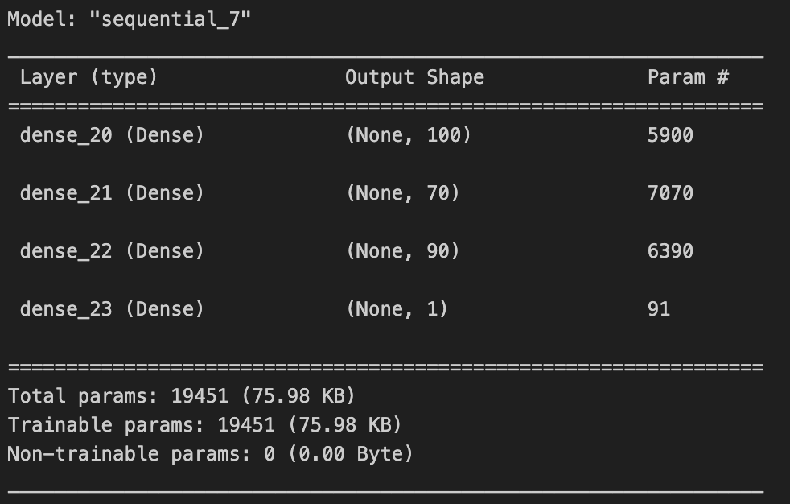
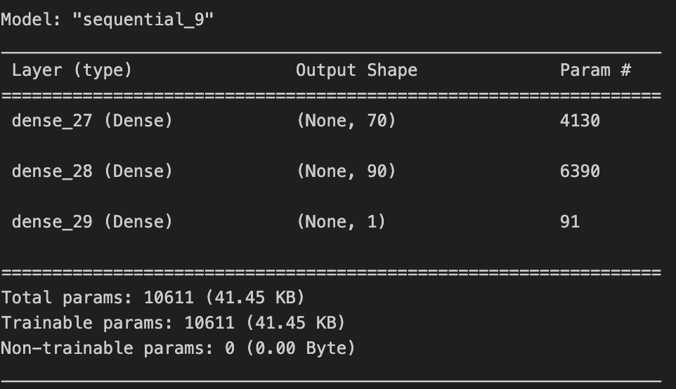
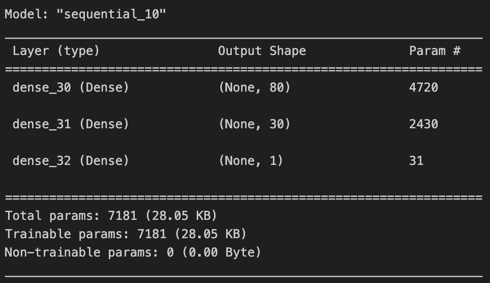

# Performance Analysis of Deep Learning Model for Alphabet Soup

## Overview of the Analysis:
The purpose of this analysis was to develop a binary classifier using deep learning models to predict the success of applicants who would like to be funded by Alphabet Soup. Using machine learning algorithms Alphabet Soup will be more successful in maximizing the impact of their funding.

## Results:

### Data Preprocessing:
- **Target Variable(s):** 
  - The target variable for the model was IS_SUCCESSFUL, indicating whether the funding was effectively used (1) or not (0).
- **Feature Variable(s):** 
  - Features used for the model included APPLICATION_TYPE, AFFILIATION, CLASSIFICATION, USE_CASE, ORGANIZATION, STATUS, INCOME_AMT, SPECIAL_CONSIDERATIONS, and ASK_AMT.
- **Variables Removed:** 
  - Initially, the EIN and NAME columns were removed as they were identification columns and not relevant for predictive modeling. However, during optimizations, the NAME column was added back due to its potential impact on model performance.

### Compiling, Training, and Evaluating the Model:

#### Neural Network Model:
- Three neural network models were created nn1, nn2, nn3, and the best performing model was nn1 .
- The best performing model consisted of three hidden layers with 100, 70 and 90 neurons, respectively, ReLU activation functions for the first, second and third hidden layers, and Sigmoid as the output layer.

#### Model Performance:
- The target model performance was set to achieve accuracy higher than 75%, but the optimization attempts were unsuccessful. Optimization techniques like adjusting bin values, adding neurons/hidden layers, using different activation functions, and modifying the number of epochs during training were utilized to help reach 75%.

## Summary:
While the deep learning model showed promising results, it fell short of reaching the desired accuracy threshold. Additional refinements may be required to improve the model's performance.

## Recommendation for a Different Model:
Considering the challenges faced in achieving the desired accuracy threshold with the deep learning model, it might be beneficial to explore alternative machine learning algorithms like Logistic Regression. Logistic Regression presents advantages in terms of simplicity, interpretability, and resilience against overfitting, which could potentially lead to improved performance for this classification task. A thorough comparison of the strengths and weaknesses of Logistic Regression compared to deep learning models can provide further insights into the recommendation.
